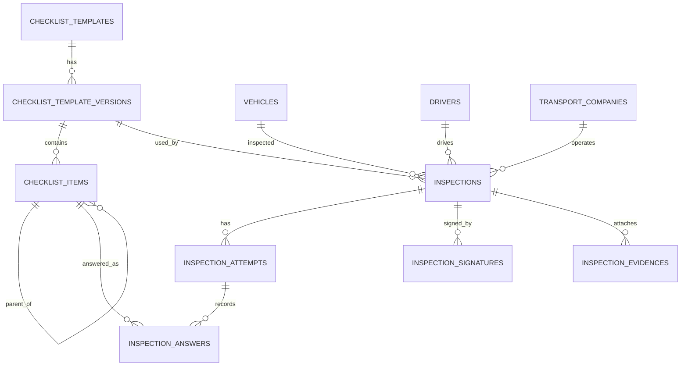

# Diseño de Base de Datos — Checklists SST TDP / TDC

**Proyecto:** Agrovisión / Grupo Indelsi S.A.C.  
**Fuente:** Anexos Check List Inspección TDP TDC  
**Motor:** PostgreSQL 16+  
**Identificadores:** UUID v7 (recomendado) o UUID v4  
**Enfoque:** Seguridad de la información + arquitectura de datos para cumplimiento SST  

---

## 1. Resumen ejecutivo

Se modelan **dos formatos** con **una sola estructura de datos**:

| Código        | Tipo | Descripción                                      | Ítems |
|---------------|------|--------------------------------------------------|-------|
| PE-F-SST-057  | TDP  | Unidades móviles propias, alquiladas y de terceros | 32 (+ 6 subítems de luces) |
| PE-F-SST-058  | TDC  | Unidades camionetas de carga                     | 21 (+ 6 subítems de luces) |

**Decisión arquitectónica (recomendada):** patrón **Plantilla → Versión → Inspección → Intentos → Respuestas**.

| Opción | Descripción | Veredicto |
|--------|-------------|-----------|
| A. Una tabla por formato (TDP / TDC) con columnas fijas | Rápida al inicio, frágil ante cambios de versión | ❌ Rechazada |
| B. JSON libre por inspección | Flexible, difícil de auditar/consultar/reportar | ❌ Rechazada |
| C. Catálogo de plantillas + ítems versionados + respuestas normalizadas | Escalable, auditable, reutilizable | ✅ **Elegida** |

Motivos de la opción C:

1. TDP y TDC comparten ~70% de campos; no se duplica lógica.
2. Cambios de versión del formulario (v1 → v2) no rompen inspecciones históricas.
3. Reportes, KPIs y alertas de vencimientos (SOAT, SCTR, etc.) son consultables con SQL.
4. Cumple requisitos de integridad, no repudio y trazabilidad (ISO 27001 / evidencias SST).

---

## 2. Inventario funcional (campos del Excel)

### 2.1 Datos generales (comunes TDP y TDC)

| Campo UI | Tipo lógico | Notas |
|----------|-------------|-------|
| Fecha 1ra inspección | date | Obligatoria en intento 1 |
| Hora 1ra inspección | time | Obligatoria en intento 1 |
| Fecha 2da inspección | date | Solo si hay re-inspección |
| Hora 2da inspección | time | Solo si hay re-inspección |
| Lugar de inspección | string | Texto libre |
| Empresa de transporte | string / FK | Catálogo maestro |
| Placa | string | Normalizar uppercase sin espacios |
| Marca / Modelo / Año | string o desglose | Se recomienda desglosar |
| N° de licencia | string | Licencia de conducir |
| Conductor | string / FK | Catálogo maestro |
| Clase y categoría de brevete | string | Ej. A-IIb |
| Fecha de revalidación | date | Del brevete |
| Resultado 1ra inspección | enum | `aprobado` / `desaprobado` |
| Resultado 2da inspección | enum | `aprobado` / `desaprobado` / null |
| Observaciones adicionales | text | Bloque libre al final |

### 2.2 Respuesta por ítem

| Campo | Tipo | Reglas |
|-------|------|--------|
| Cumple (SÍ/NO) por intento | enum `si` \| `no` \| `na` | `na` opcional para no aplica |
| Observaciones del ítem | text | Libre |
| Fecha de vencimiento | date | Solo ítems con `requires_expiry = true` |

Ítems con fecha de vencimiento (ambos formatos):

- SOAT vigente  
- SCTR vigente  
- Revisión técnica vigente  
- Extintor  

### 2.3 Firmas / V°B°

**TDP (PE-F-SST-057)**

1. Conductor de la unidad  
2. Mecánico de mantenimiento  
3. Jefe del área de transporte  
4. V°B° SST  

**TDC (PE-F-SST-058)**

1. Conductor de la unidad  
2. Responsable del área usuaria  
3. Gerencia de operaciones  
4. V°B° SST  

### 2.4 Ítems TDP (PE-F-SST-057)

| N° | Código ítem | Descripción | Subítems / extras |
|----|-------------|-------------|-------------------|
| 1 | TDP-01 | Tarjeta de propiedad | — |
| 2 | TDP-02 | SOAT vigente | `requires_expiry` |
| 3 | TDP-03 | SCTR vigente | `requires_expiry` |
| 4 | TDP-04 | Revisión técnica vigente | `requires_expiry` |
| 5 | TDP-05 | Estado de luces generales | Grupo padre (sin SÍ/NO propio, o solo contenedor) |
| 5a | TDP-05A | Luz corta | hijo de TDP-05 |
| 5b | TDP-05B | Luz larga | hijo |
| 5c | TDP-05C | Intermitente derecho | hijo |
| 5d | TDP-05D | Intermitente izquierdo | hijo |
| 5e | TDP-05E | Luz de estacionamiento | hijo |
| 5f | TDP-05F | Luz de retroceso | hijo |
| 6 | TDP-06 | Claxon | — |
| 7 | TDP-07 | Alarma de retroceso | — |
| 8 | TDP-08 | Llantas con cocada mínima de 4 mm | — |
| 9 | TDP-09 | Llanta de repuesto | — |
| 10 | TDP-10 | Gata | — |
| 11 | TDP-11 | Estado de ruedas | — |
| 12 | TDP-12 | Plumillas operativas | — |
| 13 | TDP-13 | Botiquín | — |
| 14 | TDP-14 | Extintor | `requires_expiry` |
| 15 | TDP-15 | Conos o triángulos de seguridad | — |
| 16 | TDP-16 | Tacos | — |
| 17 | TDP-17 | Espejos laterales operativos | — |
| 18 | TDP-18 | Cinturones de seguridad | — |
| 19 | TDP-19 | Salidas de emergencia | Solo TDP |
| 20 | TDP-20 | Accesorios de salidas de emergencia (martillos) | Solo TDP |
| 21 | TDP-21 | Ventanas de emergencia señalizadas | Solo TDP |
| 22 | TDP-22 | Cuenta con estrobo / tiro o cable de desenganche | Solo TDP |
| 23 | TDP-23 | Cintas retro reflectivas | — |
| 24 | TDP-24 | Pasos o pasadizos en buen estado | Solo TDP |
| 25 | TDP-25 | Asiento con espaldar y pernos completos | — |
| 26 | TDP-26 | Estado de asientos | — |
| 27 | TDP-27 | Luna delantera libre de obstáculos… | Solo TDP |
| 28 | TDP-28 | Estado de los pedales | Solo TDP |
| 29 | TDP-29 | Estado de las herramientas | Solo TDP |
| 30 | TDP-30 | Productos químicos autorizados y rotulados | Solo TDP |
| 31 | TDP-31 | Flayer de uso de cinturón de seguridad | Solo TDP |
| 32 | TDP-32 | Flayer de números de emergencia | Solo TDP |

### 2.5 Ítems TDC (PE-F-SST-058)

| N° | Código ítem | Descripción | Subítems / extras |
|----|-------------|-------------|-------------------|
| 1–18 | TDC-01 … TDC-18 | Igual que TDP-01 … TDP-18 (incl. luces 5a–5f) | — |
| 19 | TDC-19 | Cintas retro reflectivas | — |
| 20 | TDC-20 | Asiento con espaldar y pernos completos | — |
| 21 | TDC-21 | Estado de asientos | — |

> Los ítems 19–32 exclusivos de TDP **no** existen en TDC.

---

## 3. Requisitos de seguridad de la información

| Control | Cómo se materializa en BD |
|---------|---------------------------|
| **Confidencialidad** | PII del conductor (nombre, licencia) en tablas maestras; acceso por roles; cifrado en tránsito (TLS) y en reposo (TDE / disk encryption). |
| **Integridad** | Inspección `cerrada`/`aprobada` se vuelve **inmutable** (`is_locked = true`). Hash SHA-256 del snapshot JSON al cerrar. |
| **Disponibilidad** | Índices por placa, fecha, resultado; backups PITR PostgreSQL. |
| **No repudio** | Firmas con `signed_at`, `signer_user_id` o nombre + evidencia (path archivo/firma digital), IP y user-agent opcionales. |
| **Trazabilidad / auditoría** | Tabla `audit_logs` o extensión `pgaudit`; columnas `created_by`, `updated_by`, `deleted_at`. |
| **Retención** | Política de conservación de evidencias SST (ej. 5–10 años); soft delete, no hard delete de inspecciones cerradas. |
| **Separación de ambientes** | No usar datos reales de conductores en staging sin anonimizar. |
| **Control de acceso** | Roles: inspector, jefe transporte, SST, admin. Preparado para RLS por `organization_id` si hay multi-empresa. |

---

## 4. Modelo conceptual

```text
Organization (opcional)
   │
   ├── TransportCompany
   ├── Driver
   ├── Vehicle
   ├── User (inspectores / firmantes)
   │
   └── ChecklistTemplate (TDP | TDC)
           │
           └── ChecklistTemplateVersion (v1, v2…)
                   │
                   └── ChecklistItem (jerárquico parent_id)
                           │
Inspection ────────────────┘
   │  (vincula vehicle, driver, company, template_version)
   │
   ├── InspectionAttempt (nro 1 | 2)  → result, inspected_at
   │         │
   │         └── InspectionAnswer (item_id, complies, observation, expiry_date)
   │
   ├── InspectionSignature (role, name, signed_at, evidence)
   └── InspectionEvidence (fotos/archivos opcionales)
```

---

## 5. Diagrama ER (lógico)



---

## 6. Esquema físico PostgreSQL (UUID)

Convenciones:

- PK: `id UUID PRIMARY KEY DEFAULT gen_random_uuid()` (o `uuidv7()` si PostgreSQL 18+ / extensión).
- Timestamps: `timestamptz`
- Soft delete: `deleted_at timestamptz NULL`
- Enums: tipos PostgreSQL nativos
- Nombres: `snake_case`, plural

### 6.1 Tipos ENUM

```sql
CREATE TYPE vehicle_unit_type AS ENUM ('tdp', 'tdc');
CREATE TYPE ownership_type AS ENUM ('propia', 'alquilada', 'tercero');
CREATE TYPE inspection_result AS ENUM ('aprobado', 'desaprobado');
CREATE TYPE compliance_value AS ENUM ('si', 'no', 'na');
CREATE TYPE inspection_status AS ENUM (
  'borrador',
  'en_progreso',
  'pendiente_firma',
  'cerrada',
  'anulada'
);
CREATE TYPE signature_role AS ENUM (
  'conductor',
  'mecanico_mantenimiento',
  'jefe_transporte',
  'responsable_area_usuaria',
  'gerencia_operaciones',
  'vb_sst'
);
```

### 6.2 Tablas maestras

```sql
-- Extensión recomendada
CREATE EXTENSION IF NOT EXISTS pgcrypto;

CREATE TABLE transport_companies (
  id              UUID PRIMARY KEY DEFAULT gen_random_uuid(),
  legal_name      VARCHAR(255) NOT NULL,
  trade_name      VARCHAR(255),
  ruc             VARCHAR(20),
  is_active       BOOLEAN NOT NULL DEFAULT TRUE,
  created_at      TIMESTAMPTZ NOT NULL DEFAULT NOW(),
  updated_at      TIMESTAMPTZ NOT NULL DEFAULT NOW(),
  deleted_at      TIMESTAMPTZ
);

CREATE UNIQUE INDEX uq_transport_companies_ruc
  ON transport_companies (ruc)
  WHERE ruc IS NOT NULL AND deleted_at IS NULL;

CREATE TABLE drivers (
  id                  UUID PRIMARY KEY DEFAULT gen_random_uuid(),
  full_name           VARCHAR(255) NOT NULL,
  document_type       VARCHAR(20) DEFAULT 'DNI',
  document_number     VARCHAR(30),
  license_number      VARCHAR(50) NOT NULL,
  license_class       VARCHAR(50),          -- clase y categoría de brevete
  license_revalidation_date DATE,
  phone               VARCHAR(30),
  is_active           BOOLEAN NOT NULL DEFAULT TRUE,
  created_at          TIMESTAMPTZ NOT NULL DEFAULT NOW(),
  updated_at          TIMESTAMPTZ NOT NULL DEFAULT NOW(),
  deleted_at          TIMESTAMPTZ
);

CREATE UNIQUE INDEX uq_drivers_license
  ON drivers (license_number)
  WHERE deleted_at IS NULL;

CREATE TABLE vehicles (
  id                UUID PRIMARY KEY DEFAULT gen_random_uuid(),
  plate             VARCHAR(20) NOT NULL,   -- normalizar: UPPER, sin espacios
  brand             VARCHAR(100),
  model             VARCHAR(100),
  year              SMALLINT CHECK (year IS NULL OR year BETWEEN 1980 AND 2100),
  unit_type         vehicle_unit_type NOT NULL, -- tdp | tdc
  ownership_type    ownership_type,             -- útil para TDP
  seat_capacity     SMALLINT,                   -- validar sobrecupo vs tarjeta
  transport_company_id UUID REFERENCES transport_companies(id),
  is_active         BOOLEAN NOT NULL DEFAULT TRUE,
  created_at        TIMESTAMPTZ NOT NULL DEFAULT NOW(),
  updated_at        TIMESTAMPTZ NOT NULL DEFAULT NOW(),
  deleted_at        TIMESTAMPTZ
);

CREATE UNIQUE INDEX uq_vehicles_plate
  ON vehicles (plate)
  WHERE deleted_at IS NULL;
```

### 6.3 Catálogo de formularios (plantillas)

```sql
CREATE TABLE checklist_templates (
  id              UUID PRIMARY KEY DEFAULT gen_random_uuid(),
  code            VARCHAR(40) NOT NULL,     -- PE-F-SST-057 | PE-F-SST-058
  short_code      VARCHAR(10) NOT NULL,     -- TDP | TDC
  name            VARCHAR(255) NOT NULL,
  unit_type       vehicle_unit_type NOT NULL,
  description     TEXT,
  is_active       BOOLEAN NOT NULL DEFAULT TRUE,
  created_at      TIMESTAMPTZ NOT NULL DEFAULT NOW(),
  updated_at      TIMESTAMPTZ NOT NULL DEFAULT NOW()
);

CREATE UNIQUE INDEX uq_checklist_templates_code ON checklist_templates (code);
CREATE UNIQUE INDEX uq_checklist_templates_short ON checklist_templates (short_code);

CREATE TABLE checklist_template_versions (
  id                    UUID PRIMARY KEY DEFAULT gen_random_uuid(),
  checklist_template_id UUID NOT NULL REFERENCES checklist_templates(id),
  version_number        INTEGER NOT NULL,   -- 1, 2, 3…
  effective_from        DATE NOT NULL,
  effective_to          DATE,
  document_title        VARCHAR(500),
  is_published          BOOLEAN NOT NULL DEFAULT FALSE,
  created_at            TIMESTAMPTZ NOT NULL DEFAULT NOW(),
  updated_at            TIMESTAMPTZ NOT NULL DEFAULT NOW(),
  UNIQUE (checklist_template_id, version_number)
);

CREATE TABLE checklist_items (
  id                            UUID PRIMARY KEY DEFAULT gen_random_uuid(),
  checklist_template_version_id UUID NOT NULL
    REFERENCES checklist_template_versions(id) ON DELETE CASCADE,
  parent_item_id                UUID REFERENCES checklist_items(id),
  item_code                     VARCHAR(30) NOT NULL,  -- TDP-05A
  item_number                   VARCHAR(10),           -- "5", "5a"
  sort_order                    INTEGER NOT NULL,
  label                         TEXT NOT NULL,
  is_group                      BOOLEAN NOT NULL DEFAULT FALSE, -- contenedor luces
  is_required                   BOOLEAN NOT NULL DEFAULT TRUE,
  requires_expiry               BOOLEAN NOT NULL DEFAULT FALSE,
  help_text                     TEXT,
  created_at                    TIMESTAMPTZ NOT NULL DEFAULT NOW(),
  updated_at                    TIMESTAMPTZ NOT NULL DEFAULT NOW(),
  UNIQUE (checklist_template_version_id, item_code),
  UNIQUE (checklist_template_version_id, sort_order)
);

-- Roles de firma esperados por versión de plantilla
CREATE TABLE checklist_signature_slots (
  id                            UUID PRIMARY KEY DEFAULT gen_random_uuid(),
  checklist_template_version_id UUID NOT NULL
    REFERENCES checklist_template_versions(id) ON DELETE CASCADE,
  role                          signature_role NOT NULL,
  label                         VARCHAR(120) NOT NULL, -- texto del formato
  sort_order                    INTEGER NOT NULL,
  is_required                   BOOLEAN NOT NULL DEFAULT TRUE,
  UNIQUE (checklist_template_version_id, role)
);
```

### 6.4 Inspecciones (transaccional)

```sql
CREATE TABLE inspections (
  id                            UUID PRIMARY KEY DEFAULT gen_random_uuid(),
  checklist_template_version_id UUID NOT NULL
    REFERENCES checklist_template_versions(id),
  vehicle_id                    UUID NOT NULL REFERENCES vehicles(id),
  driver_id                     UUID REFERENCES drivers(id),
  transport_company_id          UUID REFERENCES transport_companies(id),

  location                      VARCHAR(255),
  additional_observations       TEXT,

  -- Snapshot denormalizado (protege historial si cambia el maestro)
  vehicle_plate_snapshot        VARCHAR(20) NOT NULL,
  vehicle_brand_model_year_snapshot VARCHAR(255),
  driver_name_snapshot          VARCHAR(255),
  driver_license_snapshot       VARCHAR(50),
  driver_license_class_snapshot VARCHAR(50),
  driver_license_revalidation_snapshot DATE,
  company_name_snapshot         VARCHAR(255),

  status                        inspection_status NOT NULL DEFAULT 'borrador',
  is_locked                     BOOLEAN NOT NULL DEFAULT FALSE,
  integrity_hash                CHAR(64),           -- SHA-256 del cierre
  closed_at                     TIMESTAMPTZ,
  closed_by                     UUID,               -- FK users si existe

  inspected_by                  UUID,               -- usuario inspector
  created_by                    UUID,
  updated_by                    UUID,
  created_at                    TIMESTAMPTZ NOT NULL DEFAULT NOW(),
  updated_at                    TIMESTAMPTZ NOT NULL DEFAULT NOW(),
  deleted_at                    TIMESTAMPTZ,

  CONSTRAINT chk_inspections_locked_closed
    CHECK (
      (is_locked = FALSE AND closed_at IS NULL)
      OR (is_locked = TRUE AND closed_at IS NOT NULL AND integrity_hash IS NOT NULL)
    )
);

CREATE INDEX idx_inspections_vehicle ON inspections (vehicle_id);
CREATE INDEX idx_inspections_status ON inspections (status);
CREATE INDEX idx_inspections_created ON inspections (created_at DESC);
CREATE INDEX idx_inspections_plate_snap ON inspections (vehicle_plate_snapshot);

CREATE TABLE inspection_attempts (
  id                UUID PRIMARY KEY DEFAULT gen_random_uuid(),
  inspection_id     UUID NOT NULL REFERENCES inspections(id) ON DELETE CASCADE,
  attempt_number    SMALLINT NOT NULL CHECK (attempt_number IN (1, 2)),
  inspected_at      TIMESTAMPTZ NOT NULL,   -- fecha + hora unificados
  result            inspection_result,      -- null mientras está en curso
  notes             TEXT,
  created_at        TIMESTAMPTZ NOT NULL DEFAULT NOW(),
  updated_at        TIMESTAMPTZ NOT NULL DEFAULT NOW(),
  UNIQUE (inspection_id, attempt_number)
);

CREATE TABLE inspection_answers (
  id                    UUID PRIMARY KEY DEFAULT gen_random_uuid(),
  inspection_attempt_id UUID NOT NULL
    REFERENCES inspection_attempts(id) ON DELETE CASCADE,
  checklist_item_id     UUID NOT NULL REFERENCES checklist_items(id),
  complies              compliance_value,   -- null = aún no respondido
  observation           TEXT,
  expiry_date           DATE,               -- SOAT/SCTR/rev.técnica/extintor
  created_at            TIMESTAMPTZ NOT NULL DEFAULT NOW(),
  updated_at            TIMESTAMPTZ NOT NULL DEFAULT NOW(),
  UNIQUE (inspection_attempt_id, checklist_item_id)
);

CREATE INDEX idx_answers_expiry
  ON inspection_answers (expiry_date)
  WHERE expiry_date IS NOT NULL;

CREATE TABLE inspection_signatures (
  id                UUID PRIMARY KEY DEFAULT gen_random_uuid(),
  inspection_id     UUID NOT NULL REFERENCES inspections(id) ON DELETE CASCADE,
  role              signature_role NOT NULL,
  signer_name       VARCHAR(255) NOT NULL,
  signer_user_id    UUID,                   -- si el firmante es usuario del sistema
  signed_at         TIMESTAMPTZ NOT NULL DEFAULT NOW(),
  signature_path    VARCHAR(500),           -- archivo / canvas PNG
  ip_address        INET,
  user_agent        TEXT,
  created_at        TIMESTAMPTZ NOT NULL DEFAULT NOW(),
  UNIQUE (inspection_id, role)
);

CREATE TABLE inspection_evidences (
  id                UUID PRIMARY KEY DEFAULT gen_random_uuid(),
  inspection_id     UUID NOT NULL REFERENCES inspections(id) ON DELETE CASCADE,
  checklist_item_id UUID REFERENCES checklist_items(id), -- opcional: foto del ítem
  file_path         VARCHAR(500) NOT NULL,
  file_mime         VARCHAR(100),
  file_size_bytes   BIGINT,
  checksum_sha256   CHAR(64),
  caption           VARCHAR(255),
  uploaded_by       UUID,
  created_at        TIMESTAMPTZ NOT NULL DEFAULT NOW()
);
```

### 6.5 Auditoría mínima

```sql
CREATE TABLE audit_logs (
  id            UUID PRIMARY KEY DEFAULT gen_random_uuid(),
  table_name    VARCHAR(100) NOT NULL,
  record_id     UUID NOT NULL,
  action        VARCHAR(20) NOT NULL, -- INSERT | UPDATE | DELETE | LOCK
  actor_id      UUID,
  old_data      JSONB,
  new_data      JSONB,
  ip_address    INET,
  created_at    TIMESTAMPTZ NOT NULL DEFAULT NOW()
);

CREATE INDEX idx_audit_record ON audit_logs (table_name, record_id);
CREATE INDEX idx_audit_created ON audit_logs (created_at DESC);
```

---

## 7. Reglas de negocio (constraints lógicos)

1. **Máximo 2 intentos** por inspección (`attempt_number ∈ {1,2}`).
2. El intento 2 solo existe si el intento 1 quedó `desaprobado` (validar en aplicación o trigger).
3. No se responden ítems con `is_group = true` (solo los hijos de luces).
4. Si `requires_expiry = true` y `complies = 'si'`, entonces `expiry_date` es obligatoria.
5. Al pasar a `cerrada`: `is_locked = true`, se calcula `integrity_hash`, no se permiten UPDATE/DELETE (trigger).
6. Firmas requeridas según `checklist_signature_slots` de la versión usada.
7. Placa única en maestro; en inspección se guarda snapshot.
8. Resultado final operativo = resultado del **último intento** existente.

### Trigger de inmutabilidad (esqueleto)

```sql
CREATE OR REPLACE FUNCTION prevent_locked_inspection_mutation()
RETURNS TRIGGER AS $$
BEGIN
  IF OLD.is_locked THEN
    RAISE EXCEPTION 'Inspección bloqueada (cerrada). No se puede modificar.';
  END IF;
  RETURN NEW;
END;
$$ LANGUAGE plpgsql;

CREATE TRIGGER trg_inspections_immutable
BEFORE UPDATE OR DELETE ON inspections
FOR EACH ROW
WHEN (OLD.is_locked IS TRUE)
EXECUTE FUNCTION prevent_locked_inspection_mutation();
```

---

## 8. Seed de plantillas (resumen)

```text
checklist_templates
  ├─ PE-F-SST-057 / TDP / unit_type=tdp
  └─ PE-F-SST-058 / TDC / unit_type=tdc

checklist_template_versions
  ├─ TDP v1 (effective_from = 2026-01-01, published)
  └─ TDC v1 (effective_from = 2026-01-01, published)

checklist_signature_slots TDP:
  1 conductor, 2 mecanico_mantenimiento, 3 jefe_transporte, 4 vb_sst

checklist_signature_slots TDC:
  1 conductor, 2 responsable_area_usuaria, 3 gerencia_operaciones, 4 vb_sst
```

Ítems: cargar los de las tablas §2.4 y §2.5 con `sort_order` secuencial; luces con `parent_item_id` apuntando al ítem 5.

---

## 9. Consultas clave (valor de negocio)

### Unidades desaprobadas en 1ra que aún no tienen 2da

```sql
SELECT i.id, i.vehicle_plate_snapshot, a1.inspected_at
FROM inspections i
JOIN inspection_attempts a1
  ON a1.inspection_id = i.id AND a1.attempt_number = 1
LEFT JOIN inspection_attempts a2
  ON a2.inspection_id = i.id AND a2.attempt_number = 2
WHERE a1.result = 'desaprobado'
  AND a2.id IS NULL
  AND i.deleted_at IS NULL;
```

### Documentos por vencer (30 días)

```sql
SELECT i.vehicle_plate_snapshot, ci.label, ans.expiry_date
FROM inspection_answers ans
JOIN inspection_attempts att ON att.id = ans.inspection_attempt_id
JOIN inspections i ON i.id = att.inspection_id
JOIN checklist_items ci ON ci.id = ans.checklist_item_id
WHERE ans.expiry_date BETWEEN CURRENT_DATE AND CURRENT_DATE + 30
  AND i.status = 'cerrada'
ORDER BY ans.expiry_date;
```

### % de cumplimiento por ítem (TDP)

```sql
SELECT ci.item_number, ci.label,
       ROUND(100.0 * COUNT(*) FILTER (WHERE ans.complies = 'si') / NULLIF(COUNT(*),0), 1) AS pct_si
FROM inspection_answers ans
JOIN checklist_items ci ON ci.id = ans.checklist_item_id
JOIN checklist_template_versions ctv ON ctv.id = ci.checklist_template_version_id
JOIN checklist_templates ct ON ct.id = ctv.checklist_template_id
WHERE ct.short_code = 'TDP' AND ci.is_group = FALSE
GROUP BY ci.item_number, ci.label, ci.sort_order
ORDER BY ci.sort_order;
```

---

## 10. Mapeo Laravel (referencia rápida)

| Tabla | Modelo Eloquent sugerido |
|-------|--------------------------|
| `checklist_templates` | `ChecklistTemplate` |
| `checklist_template_versions` | `ChecklistTemplateVersion` |
| `checklist_items` | `ChecklistItem` |
| `vehicles` | `Vehicle` |
| `drivers` | `Driver` |
| `transport_companies` | `TransportCompany` |
| `inspections` | `Inspection` |
| `inspection_attempts` | `InspectionAttempt` |
| `inspection_answers` | `InspectionAnswer` |
| `inspection_signatures` | `InspectionSignature` |
| `inspection_evidences` | `InspectionEvidence` |

Usar `$table->uuid('id')->primary()` y `HasUuids` (o UUID v7 custom).

---

## 11. Qué NO hacer

1. No crear `inspections_tdp` e `inspections_tdc` con columnas distintas.  
2. No guardar SÍ/NO en columnas `item_1`, `item_2`…  
3. No borrar físicamente inspecciones cerradas.  
4. No permitir editar respuestas después del cierre.  
5. No mezclar “catálogo de ítems” con “respuestas” en la misma tabla.

---

## 12. Próximos pasos sugeridos

1. Validar redacción oficial de ítems contra formato AGV (nota del Excel: reconstruido desde TDR).  
2. Generar migraciones Laravel + seeders TDP/TDC v1.  
3. Definir políticas de roles (Spatie / Gates) y cierre con hash.  
4. Alertas de vencimiento (jobs diarios).  
5. Export PDF del checklist firmado (evidencia SST).

---

## 13. Conteos de tablas

| Capa | Tablas |
|------|--------|
| Maestros | 3 (`transport_companies`, `drivers`, `vehicles`) |
| Catálogo SST | 4 (`checklist_templates`, `checklist_template_versions`, `checklist_items`, `checklist_signature_slots`) |
| Operación | 5 (`inspections`, `inspection_attempts`, `inspection_answers`, `inspection_signatures`, `inspection_evidences`) |
| Seguridad | 1 (`audit_logs`) |
| **Total** | **13 tablas** |

Este diseño cubre ambos formatos, versiones futuras, 1ra/2da inspección, vencimientos, firmas diferenciadas TDP/TDC, auditoría e integridad para PostgreSQL con UUID.
